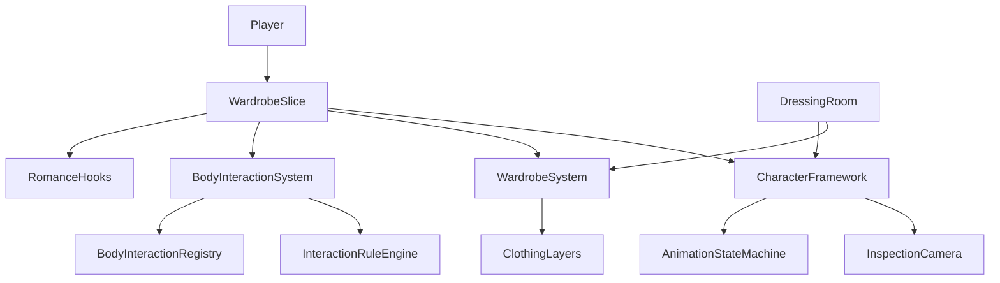

# Phase 4: Body-Aware Interaction + Wardrobe Simulation

## Overview

Phase 4 delivers a mature body-aware interaction framework, full wardrobe and dressing-room simulation, romance/life-sim hooks, animation layering, extended camera modes, and a playable wardrobe vertical slice.

## Modules

### `eve::human` — Body & Wardrobe

| System | Description |
|--------|-------------|
| `BodyRegion` / `BodyRegionVolume` | 13 named interaction regions with hover/query support |
| `InteractionRuleEngine` | Trust, affection, consent, rating, room permission checks |
| `BodyInteractionSystem` | Data-driven JSON interactions per body region |
| `WardrobeSystem` | Clothing layers, compatibility, outfit save/load |
| `DressingRoomController` | Try-on, mirror, photo, animation preview actions |

### `eve::ai` — Romance Hooks

| System | Description |
|--------|-------------|
| `RomanceSimulationHooks` | Compliments, flirting, gifts, boundaries, relationship memory |

### `eve::animation` — Layer Stack

| System | Description |
|--------|-------------|
| `AnimationLayerStack` | Multi-layer blending: locomotion, gestures, facial, cloth, hair |

### `eve::render` — Extended Graphics

| System | Description |
|--------|-------------|
| `InspectionCamera` | Wardrobe, mirror, body-region focus, smooth transitions |
| `HumanShaderPipeline` | Makeup, jewelry, cloth wetness parameters |
| `MirrorRenderer` | Mirror surface registration and reflection pass hook |

### `eve::editor` — Wardrobe Tools

Editor panel scaffolds in `wardrobe_tools.hpp`:

- Body region setup
- Clothing item setup
- Outfit builder
- Wardrobe room preview
- Interaction graph
- Relationship reaction editor
- Animation layer debugger
- Camera preset editor
- Material preview
- Mirror preview
- Clipping debugger

## Data Files

```
data/
  characters/default/
    body_definition.json    — 13 body region volumes
    female_preset.json      — Sample character preset
  wardrobe/
    items.json              — 10 clothing items
    outfits.json            — 3 saved outfit presets
  interactions/
    body_regions.json       — Data-driven body interactions
    wardrobe_room.json      — 5 room interaction objects
  romance/
    reactions.json          — 5 romance dialogue reactions
  camera/
    wardrobe_presets.json   — Camera presets for wardrobe room
  animation/
    layers.json             — Animation layer definitions
```

## Wardrobe Vertical Slice

```bash
./build/apps/wardrobe_slice/eve-wardrobe-slice data
```

The vertical slice demonstrates:

1. Camera orbit, zoom, and pan
2. Body region selection with camera focus
3. Outfit changes with layer compatibility
4. Walk/sit/pose animation preview
5. Mirror inspection mode
6. Romance reaction triggers
7. Outfit preset save/load
8. Photo-mode HDR screenshot capture

## Testing

```bash
cmake --build build
ctest --test-dir build --output-on-failure
```

Phase 4 adds tests for:

- Body region ray targeting
- Wardrobe layering and compatibility
- Outfit save/load serialization
- Camera focus transitions
- Interaction permission checks
- Romance reaction updates
- Animation layer blending
- Wardrobe vertical slice integration

## Architecture



## Content Rating

All body interactions and camera modes respect `ContentRating` and `ConsentState` checks. Camera lockouts prevent restricted views when rating mode is set below required level.
