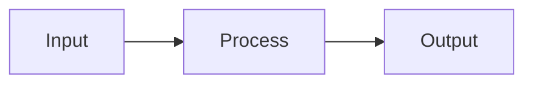

# Subsystem: `<subsystem_name>`

## Owner Module

`engine/<module>/`

## Responsibilities

- Primary responsibility
- Secondary responsibility

## Key Types

| Type | Role |
|------|------|
| | |

## Data Flow

## Performance Targets

| Metric | Target |
|--------|--------|
| | |

## Test Coverage

| Test File | Validates |
|-----------|-----------|
| | |

## Open Questions

- 
